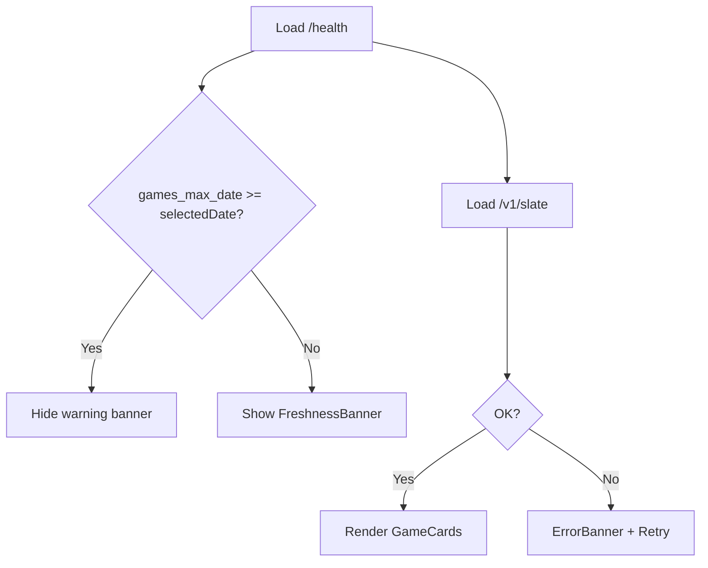

# MLB Slate MVP — UX / Visual Spec

**Version:** 1.0  
**Author:** AGENT_DESIGN (TASK-26)  
**Consumers:** TASK-23 (app shell), TASK-24 (slate), TASK-25 (game detail), TASK-27 (content pages)  
**API contract:** TASK-21 `GamePrediction` + `GET /health` → `games_max_date`

---

## Product intent

A read-only **sports-analytics** site that surfaces daily MLB pregame ensemble predictions. The UI should feel like a research dashboard — clear numbers, transparent methodology, no sportsbook chrome (no odds ladders, bet slips, or “lock” language).

**v1 theme:** **Light mode only.** Dark mode is out of scope for MVP; token names are structured so a future dark palette can swap values without renaming.

---

## User flows

| Flow | Description |
|------|-------------|
| **Browse today’s slate** | User lands on `/` (or `/mlb`), sees today’s games with predicted totals and implied winner; taps a card for detail. |
| **Pick another date** | User changes the date picker; slate refetches for that date; freshness banner updates if data lags the selected date. |
| **Inspect a game** | From slate, user opens game detail with scoreline-style prediction, win probability, and optional member breakdown. |
| **Understand the model** | User follows “How it works” / nav to Methodology; reads ensemble explanation and holdout metrics (copy from TASK-27). |
| **Legal / trust** | User opens Disclaimer from footer or nav before relying on predictions. |

---

## Information architecture

```text
/  (or /mlb)                    Daily slate
/mlb/game?home=&away=&date=     Game detail
/methodology                    Trust / methodology (TASK-27 copy)
/disclaimer                     Legal disclaimer (TASK-27 copy)
```

**Redirects:** `/mlb` and `/` may alias to the same slate view. Canonical for SEO (TASK-35) is TBD; frontend should pick one and stick to it.

---

## Global chrome

### Header

Fixed or sticky top bar on all pages. Mobile: hamburger not required at MVP — compact horizontal nav with wrap.

```text
┌─────────────────────────────────────────────────────────────┐
│  gametime          Slate   Methodology   Disclaimer         │
└─────────────────────────────────────────────────────────────┘
```

| Element | Spec |
|---------|------|
| **Product name** | “gametime” — lowercase wordmark, `--font-size-lg`, `--font-weight-semibold`, links to `/` |
| **Nav items** | Slate (`/`), Methodology (`/methodology`), Disclaimer (`/disclaimer`) |
| **Active state** | `--color-accent` bottom border (2px) or text color; `aria-current="page"` |
| **Height** | 56px mobile, 64px ≥ `--breakpoint-md` |
| **Background** | `--color-surface` with `--shadow-sm` bottom border `--color-border` |

### Footer

```text
┌─────────────────────────────────────────────────────────────┐
│  Data: MLB Stats API, pybaseball, Open-Meteo sidecars.    │
│  Predictions are not gambling advice. See Disclaimer.       │
│  © gametime                                                  │
└─────────────────────────────────────────────────────────────┘
```

| Element | Spec |
|---------|------|
| **Data sources** | One line; link “Disclaimer” → `/disclaimer` |
| **Tone** | Factual, small (`--font-size-sm`, `--color-text-secondary`) |
| **Padding** | `--space-6` vertical, `--space-4` horizontal |

### Page shell (TASK-23)

```text
┌ Header ─────────────────────────────────────┐
│  <main> max-width 720px (slate) / 640px (game) │
│  padding --space-4 mobile, --space-6 desktop   │
├ Footer ───────────────────────────────────────┤
```

- **Max content width:** slate 720px; game detail 640px; methodology/disclaimer 680px prose column.
- **Main landmark:** single `<main>` per page; skip link “Skip to content” (visually hidden until focus).

---

## Design tokens

Implement as CSS custom properties on `:root` in a global stylesheet (e.g. `web/styles/tokens.css`). Components use tokens only — no hard-coded hex in component modules.

### Color

| Token | Light value | Usage |
|-------|-------------|-------|
| `--color-bg` | `#f6f7f9` | Page background |
| `--color-surface` | `#ffffff` | Cards, header, footer |
| `--color-surface-muted` | `#eef0f4` | Skeleton shimmer, table zebra |
| `--color-border` | `#d8dce3` | Card borders, dividers |
| `--color-text-primary` | `#1a1d23` | Headings, team names |
| `--color-text-secondary` | `#5c6370` | Meta, labels, footer |
| `--color-text-muted` | `#8b919a` | Placeholder, disabled |
| `--color-accent` | `#2563eb` | Links, active nav, focus ring base |
| `--color-accent-muted` | `#dbeafe` | Winner pill background (home favored) |
| `--color-winner` | `#15803d` | Winner team name / check accent |
| `--color-winner-bg` | `#dcfce7` | Winner highlight on card |
| `--color-away-accent` | `#64748b` | Away team secondary emphasis |
| `--color-warning` | `#b45309` | Stale-data banner text |
| `--color-warning-bg` | `#fef3c7` | Stale-data banner background |
| `--color-error` | `#b91c1c` | API error text |
| `--color-error-bg` | `#fee2e2` | Error banner background |
| `--color-focus-ring` | `#2563eb` | `:focus-visible` outline |

All text/background pairs above target **WCAG AA** (4.5:1 body, 3:1 large text).

### Typography

System stack (no webfont load for MVP):

```css
--font-family: system-ui, -apple-system, "Segoe UI", Roboto, "Helvetica Neue", Arial, sans-serif;
--font-family-mono: ui-monospace, "SF Mono", Menlo, Consolas, monospace;
```

| Token | Size | Weight | Use |
|-------|------|--------|-----|
| `--font-size-xs` | 0.75rem (12px) | 400 | Footer, badges |
| `--font-size-sm` | 0.875rem (14px) | 400 | Labels, banner, secondary stats |
| `--font-size-base` | 1rem (16px) | 400 | Body |
| `--font-size-lg` | 1.125rem (18px) | 600 | Card team names |
| `--font-size-xl` | 1.5rem (24px) | 600 | Page title “MLB Slate” |
| `--font-size-2xl` | 1.875rem (30px) | 700 | Game detail scoreline |
| `--font-weight-normal` | 400 | | Body |
| `--font-weight-medium` | 500 | | Labels |
| `--font-weight-semibold` | 600 | | Emphasis |
| `--font-weight-bold` | 700 | | Scoreline numbers |
| `--line-height-tight` | 1.25 | | Headings |
| `--line-height-normal` | 1.5 | | Body |

### Spacing & layout

| Token | Value |
|-------|-------|
| `--space-1` | 4px |
| `--space-2` | 8px |
| `--space-3` | 12px |
| `--space-4` | 16px |
| `--space-5` | 20px |
| `--space-6` | 24px |
| `--space-8` | 32px |
| `--radius-sm` | 6px |
| `--radius-md` | 10px |
| `--radius-lg` | 14px |
| `--shadow-sm` | `0 1px 2px rgba(26, 29, 35, 0.06)` |
| `--shadow-md` | `0 4px 12px rgba(26, 29, 35, 0.08)` |

**Breakpoints**

| Token | Width | Layout |
|-------|-------|--------|
| `--breakpoint-sm` | 480px | Slightly wider card padding |
| `--breakpoint-md` | 768px | Slate: 2-column game grid |
| `--breakpoint-lg` | 1024px | Max-width container centered |

**Base unit:** 4px grid; card padding `--space-4` mobile, `--space-5` ≥ md.

---

## Data freshness UX

Driven by `GET /health` → `games_max_date` compared to the **selected slate date** (not merely “today”).

| Condition | Banner | Behavior |
|-----------|--------|----------|
| `games_max_date` ≥ selected date | **Hidden** (or subtle “Data through {games_max_date}” in footer only) | Normal slate |
| `games_max_date` < selected date | **Warning banner** below header | Show message; slate may still load if API returns games |
| `games_max_date` < today AND user on today | **Warning banner** | “Predictions may be stale — game data last updated {games_max_date}.” |
| Health fetch fails | **Non-blocking** small warning in banner area | Slate can still attempt load; show error only if slate also fails |

**Banner component**

```text
┌─────────────────────────────────────────────────────────────┐
│ ⚠  Data last updated Jun 8, 2026. Predictions for Jun 9    │
│    may be incomplete until the daily refresh runs.        │
└─────────────────────────────────────────────────────────────┘
```

- Role: `role="status"` (not `alert` unless slate API also failed).
- Dismiss: not dismissible in v1 (always visible when stale).
- Color: `--color-warning-bg` / `--color-warning`.
- Aligns with TASK-22 stale-data guard (API may later return 503; frontend shows same banner + error state).

---

## Page: Daily slate (TASK-24)

**Route:** `/` or `/mlb`  
**API:** `GET /v1/slate?date=YYYY-MM-DD` + `GET /health`

### Wireframe (mobile)

```text
┌ Header ─────────────────────────────────────┐
├ [Freshness banner if stale] ────────────────┤
│                                             │
│  MLB Slate                                  │  ← h1
│  ┌─────────────────────────────────────┐   │
│  │  ◀  Tue, Jun 9, 2026  ▶   [Today] │   │  ← DatePicker
│  └─────────────────────────────────────┘   │
│  15 games · Regular season                  │  ← meta line
│                                             │
│  ┌─ GameCard ───────────────────────────┐  │
│  │  BOS  @  NYY                         │  │
│  │  Predicted total    9.2 runs         │  │
│  │  Pick: NYY  ·  58% home win          │  │
│  │  Margin: NYY −1.1                    │  │  ← compact margin
│  └──────────────────────────────────────┘  │
│  ┌─ GameCard ───────────────────────────┐  │
│  │  ...                                 │  │
│  └──────────────────────────────────────┘  │
│                                             │
├ Footer ─────────────────────────────────────┤
```

### Wireframe (tablet+, ≥768px)

Game cards in **2-column grid**, gap `--space-4`.

### Heading structure

1. `h1` — “MLB Slate”
2. `h2` visually hidden or omitted; each `GameCard` uses `h2` for matchup “Boston Red Sox at New York Yankees” with visible tricodes, or `article` + `aria-labelledby`.

### Game card content mapping

| UI label | API field | Format |
|----------|-----------|--------|
| Matchup | `away`, `home` | `{away} @ {home}` tricodes; optional expand to full names on detail only |
| Predicted total | `pred_total` | 1 decimal: “9.2 runs” |
| Pick | `winner`, `win_prob_home` | If `winner === home`: “{home} · {win_prob_home}% home win”; else “{away} · {100 - win_prob_home}% away win” (round win % to integer) |
| Margin | `pred_margin` | “{favored} −{abs(margin)}” where favored team from margin sign; 1 decimal |
| Playoff badge | `is_playoff` | Small pill “Postseason” when true |

**Winner styling:** winning tricode row gets `--color-winner-bg` left border (4px `--color-winner`) or subtle background on the pick line.

**Interaction:** entire card is a link to `/mlb/game?home={home}&away={away}&date={date}`. Hover: `--shadow-md`; focus-visible: 2px `--color-focus-ring` outline.

**Card density:** compact — target ~88px min-height mobile; do not show member breakdown on slate.

### Date picker

| Control | Behavior |
|---------|----------|
| Previous / next day | Buttons with `aria-label` “Previous day” / “Next day” |
| Date display | Button opens native `<input type="date">` or accessible date dialog |
| “Today” shortcut | Resets to local today; hidden when already today |
| Default | Today in user’s local timezone |
| URL | Sync `?date=YYYY-MM-DD` query param for shareable links |

### Meta line

`{n} games · Regular season` or `No games scheduled` / `Postseason` when applicable.

### Empty state

```text
┌─────────────────────────────────────┐
│         (calendar icon)              │
│   No games on this date              │
│   Try another date or check back     │
│   during the regular season.         │
└─────────────────────────────────────┘
```

- API `200` with `games: []`.
- No error styling.

### Loading state

- Skeleton: 3–5 `GameCard` placeholders, shimmer on `--color-surface-muted`.
- Date picker disabled while loading.
- Banner may load in parallel.

### API error state

```text
┌─ error banner ─────────────────────────────┐
│ Couldn’t load slate. Try again.  [Retry]   │
└────────────────────────────────────────────┘
```

- `role="alert"`.
- Retry refetches slate + health.

---

## Page: Game detail (TASK-25)

**Route:** `/mlb/game?home=NYY&away=BOS&date=2026-06-09`  
**API:** `GET /v1/game?...` and optionally `include_members=true` for breakdown (or separate fetch — frontend choice).

### Wireframe

```text
┌ Header ─────────────────────────────────────┐
│  ← Back to slate                            │
│                                             │
│  BOS @ NYY                                  │  ← h1
│  Tuesday, June 9, 2026                      │
│                                             │
│  ┌─ ScorelineCard ──────────────────────┐  │
│  │      BOS 3.4  ─  5.6 NYY             │  │  ← pred_away_final @ pred_home_final
│  │      Total: 9.0 runs                 │  │
│  │      Winner: NYY (58% home)          │  │
│  └──────────────────────────────────────┘  │
│                                             │
│  ┌─ Collapsible: Member breakdown ▼ ────┐  │
│  │  Member      Total   Margin          │  │
│  │  lgbm        9.1     +1.2            │  │
│  │  heuristic   8.8     +0.9            │  │
│  │  ...                                 │  │
│  └──────────────────────────────────────┘  │
│                                             │
│  How we calculate this → Methodology        │
│                                             │
├ Footer ─────────────────────────────────────┤
```

### Scoreline block

| Element | API | Notes |
|---------|-----|-------|
| Away runs | `pred_away_final` | 1 decimal, monospace optional for numbers |
| Home runs | `pred_home_final` | Winner side: `--color-winner` on score |
| Total | `pred_total` | “Total: X.X runs” |
| Winner line | `winner`, `win_prob_home` | “Winner: {tricode} ({pct}% {home\|away})” |

Display as **predicted final**, not live score — label subtly: “Predicted final” (`--font-size-sm`, `--color-text-secondary`) above scoreline to avoid confusion.

### Member breakdown (collapsible)

- Default: **collapsed** on mobile; **expanded** on ≥ md optional — default collapsed everywhere for consistency.
- Toggle: `<button aria-expanded>` + `aria-controls` panel id.
- Table: `member_totals[name]`, `member_margins[name]`; sort default ensemble order from `/health` `ensemble_members` if available, else alphabetical.
- Margin display: signed with `+` for home-favored.
- When `include_members=false` or keys absent: hide section entirely (no empty accordion).

### Links

- “Back to slate” → `/?date={date}`
- “How we calculate this” → `/methodology`

### States

| State | UX |
|-------|-----|
| Loading | Scoreline skeleton + one table row skeleton |
| 404 / not found | “Game not found on this date” + link to slate |
| Error | Same pattern as slate retry banner |

### Heading structure

- `h1` — matchup `{away} @ {home}`
- `h2` — “Predicted outcome” (scoreline section)
- `h2` — “Member breakdown” (collapsible)

---

## Page: Methodology (TASK-27 layout)

**Route:** `/methodology`  
**Content:** `web/content/methodology.md` (TASK-27)

### Wireframe

```text
┌ Header ─────────────────────────────────────┐
│                                             │
│  How predictions work                       │  ← h1 (from content title)
│                                             │
│  ┌─ ProseLayout (max-width 680px) ─────┐   │
│  │  [Rendered markdown sections]        │   │
│  │  ## What we predict                  │   │
│  │  ## Ensemble approach                │   │
│  │  ## Data sources                     │   │
│  │  ## Holdout discipline               │   │
│  │  ## Reported accuracy                │   │
│  │  ...                                 │   │
│  └──────────────────────────────────────┘   │
│                                             │
│  See also: Disclaimer                       │
│                                             │
├ Footer ─────────────────────────────────────┤
```

**Prose styles:** `--font-size-base`, headings `--font-weight-semibold`, lists with `--space-3` gap, tables full-width with border. Member table from copy: zebra `--color-surface-muted`.

---

## Page: Disclaimer (TASK-27 layout)

**Route:** `/disclaimer`  
**Content:** `web/content/disclaimer.md`

Same `ProseLayout` as Methodology. `h1` from frontmatter title. No sidebar. Optional callout box at top:

```text
┌─ callout (--color-surface-muted) ────────────┐
│  Not gambling advice. Read carefully.      │
└────────────────────────────────────────────┘
```

---

## Component inventory

| Component | Task | Description |
|-----------|------|-------------|
| `AppShell` | TASK-23 | Header + main + footer layout |
| `SiteHeader` | TASK-23 | Logo, nav links, active state |
| `SiteFooter` | TASK-23 | Sources one-liner, disclaimer link |
| `SkipLink` | TASK-23 | Accessibility skip to main |
| `FreshnessBanner` | TASK-24 | Stale data warning from `/health` |
| `DatePicker` | TASK-24 | Prev/next, date input, Today |
| `SlatePage` | TASK-24 | Page composition, meta line |
| `GameCard` | TASK-24 | Slate row card → link to detail |
| `GameCardSkeleton` | TASK-24 | Loading placeholder |
| `EmptySlate` | TASK-24 | Zero games state |
| `ErrorBanner` | TASK-24 | API error + retry |
| `GameDetailPage` | TASK-25 | Detail composition |
| `ScorelineCard` | TASK-25 | Predicted finals + winner |
| `MemberBreakdown` | TASK-25 | Collapsible table |
| `BackLink` | TASK-25 | Return to slate |
| `ProseLayout` | TASK-23/27 | Markdown content pages |
| `Callout` | TASK-27 | Disclaimer top notice |
| `Button` / `Link` | TASK-23 | Shared interactive styles |
| `Badge` | TASK-24 | Postseason pill |

### Shared interactive styles (TASK-23)

**Links:** `--color-accent`, underline on hover, no underline default.  
**Buttons (secondary):** border `--color-border`, padding `--space-2` `--space-4`, `--radius-sm`.  
**Focus:** all interactives use `:focus-visible { outline: 2px solid var(--color-focus-ring); outline-offset: 2px; }`.

---

## Accessibility checklist

| Requirement | Implementation |
|-------------|----------------|
| Color contrast | AA per token table |
| Focus | Visible on all links, buttons, date controls, accordion toggle |
| Headings | One `h1` per page; logical order on slate and detail |
| Live regions | Error `role="alert"`; freshness `role="status"` |
| Cards as links | Single focus stop; descriptive `aria-label` e.g. “Boston at New York, predicted total 9.2, pick New York” |
| Motion | Respect `prefers-reduced-motion` — disable skeleton shimmer |
| Touch targets | Min 44×44px for date nav and Today button |

---

## API field reference (frontend)

```typescript
// Align with TASK-21 GamePrediction
interface GamePrediction {
  home: string;
  away: string;
  date: string;
  pred_total: number;
  pred_margin: number;
  pred_home_final: number;
  pred_away_final: number;
  winner: string;
  win_prob_home: number; // 0–1, display as %
  is_playoff: boolean;
  home_form_n: number;
  away_form_n: number;
  member_totals?: Record<string, number>;
  member_margins?: Record<string, number>;
}

interface HealthResponse {
  status: string;
  games_max_date: string; // YYYY-MM-DD
  model_dir: string;
  ensemble_members: string[];
}
```

**Display note:** `win_prob_home` is 0–1 in API; multiply by 100 for UI. When winner is away, show away win % as `(1 - win_prob_home) * 100`.

---

## Out of scope (v1)

| Item | Notes |
|------|-------|
| Dark mode | Light-only MVP |
| Odds / edge / market line UI | TASK-32 / Epic 7 |
| User accounts / saved slates | TASK-34 |
| NBA or multi-sport nav | TASK-36 |
| Live in-game scores | Model is pregame only |
| Auth, paywalls, ads | — |
| SEO meta / structured data | TASK-35 |
| Team logos / official MLB branding | Tricode text only; avoids asset licensing |
| Inline betting language | No “pick”, “lock”, “unit” — use “Pick” sparingly as “model favorite” |
| Quantile / interval bands | TASK-15 |
| Dismissible freshness banner | Always show when stale |
| Print stylesheet | — |

---

## Mermaid: stale-data decision



---

## Handoff notes for AGENT_FRONTEND

1. Import tokens once in TASK-23; all TASK-24/25 components consume CSS variables.
2. Prefer CSS Modules per component; class names mirror component names (`GameCard.module.css`).
3. Slate and game routes should read `date` from URL search params.
4. Freshness banner logic should live in a small hook e.g. `useDataFreshness(health, selectedDate)` for TASK-22 alignment.
5. Methodology/Disclaimer: render TASK-27 markdown through shared `ProseLayout`; headings in markdown should not duplicate page `h1` — strip first `#` or map frontmatter `title` to `h1`.

### Open questions for frontend

| Question | Recommendation |
|----------|----------------|
| `/` vs `/mlb` canonical | Use `/` as canonical; redirect `/mlb` → `/` |
| Full team names on slate? | Tricode only on cards; full names optional later |
| `include_members` on game page | Default `true` on detail page only |
| Number formatting | `Intl.NumberFormat` en-US, 1 decimal for runs |
| Timezone for “today” | User local timezone for date picker default |

---

## File map

| Path | Owner |
|------|-------|
| `docs/design/mlb-slate-mvp-spec.md` | TASK-26 (this doc) |
| `web/styles/tokens.css` | TASK-23 |
| `web/components/*` | TASK-23–25 |
| `web/content/*.md` | TASK-27 |
